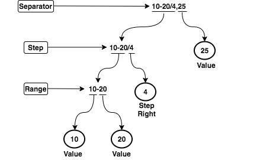

# Cron Expression Parser

The following project is a simple Cron Expression Parser. It takes a cron input in a form of minutes, hours, days (months), months and days (week) and a command to be executed. An example input could be `"*/15 0 1,15 * 1-5 /usr/bin/find"`.

## Requirements

### Technologies

* [Java 11](https://www.java.com/en/download/)
* [Maven 3](https://maven.apache.org/)
* [JaCoCo](https://www.eclemma.org/jacoco/)

### Frameworks

* [JUnit 4](https://junit.org/junit4/)

## Data Model

The data model consist of fields and their expression parses.

### Fields

A field represents a range of integer values to be evaluated by the parser. The field is constrained by it's lower and upper boundaries. Both boundaries are decided based on the type of the field. The following are the available field types:

| **Field**   | **Min** | **Max** |
| ----------- | ------- | ------- |
| Minute      | 0       | 59      |
| Hour        | 0       | 23      |
| Day (month) | 1       | 31      |
| Month       | 1       | 12      |
| Day (week)  | 0       | 6       |

### Expression Parsers

The design of expression parsers is based on the [Interpreter Pattern](https://www.tutorialspoint.com/design_pattern/interpreter_pattern.htm) using fields as the context. The process starts from the widest possible range of integers and reduces the result every time the input string goes through each of the parsers.

All expression parsers are chained together in a sequential manner. The input string is moving through the parsers until it's content is exhausted or an error occurs. The following picture illustrates the chaining of the expression parsers.



Each individual parser is comprised of two methods: **match** and **interpret**. The **match** method is responsible for telling if the current parser should be applied or not. This decision is done by looking up a unique token of a given parser in the input string. If the decision is positive, the parser invokes an **interpret** method. If the decision is negative, the parser passes the input down the funnel to the next parser, if any. The **interpret** method is responsible for the actual parsing of the input string with accordance to the field provided.

The following table summarizes all of the expresion parsers along with their details:

| **Order Number** | **Parser Name** | **Token** | **Matching Rule** |
| ---------------- | --------------- | --------- | ----------------- |
| 1                | Separator       | `,`       | contains          |
| 2                | Step            | `/`       | contains          |
| 3                | AnyValue        | `*`       | equals            |
| 4                | Range           | `-`       | contains          |
| 5                | Value           | none      | always true       |

#### Separator Parser

Separator parser is the first expression parser in the chain. It looks for `,` token, splits the comma separated input into an array of inputs and invokes the Step parser for each of them.

If `,` token is not found, the input is passed to the Step parser.

#### Step Parser

Step parser checks if the `/` token is present in the input string. If so, it splits the input string by the `/` token into two parts. Left part is passed for further parsing to the AnyValue parser. The right part is parsed into an integer. After the left part is evaluated, the step integer from the right part will be applied to the range of integers from the left part.

If `/` token is not found, the input is passed to the AnyValue parser.

#### AnyValue Parser

If `*` token equals to the input string, the AnyValue parser will return a full range of integers from fields min value to fields max value.

If `*` token is not found, the input is passed to the Range parser.

#### Range Parser

If `-` token is found in the input string, the Range parser will split the input by `-` token and return a range of integers between the its left and right parts.

If `-` token is not found, the input is passed to the Value parser.

#### Value Parser

Value parser converts an input string to an integer and returns a set of one element.

Value parser is a terminal parser and it does not have any successor. 

## Build

```shell script
mvn clean install
```

## Run

```shell script
java -jar target/CronExpressionParser-1.0-SNAPSHOT-jar-with-dependencies.jar "*/15 0 1,15 * 1-5 /usr/bin/find"
```

Use this tool to craft you own cron expression: [CronTab](https://crontab.guru/)
